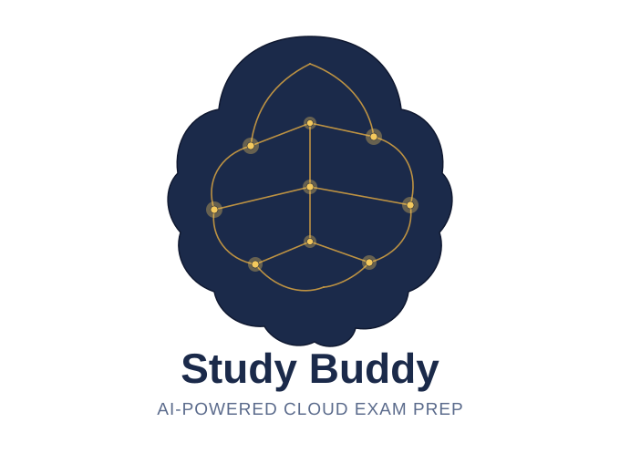

# 

# 

# 

# 

# 



# 

# 

# 

# AWS Cloud Practitioner RAG Study Buddy

A fully local, offline retrieval-augmented generation (RAG) tool for
studying the AWS Certified Cloud Practitioner (CLF-C02) exam. Ask
questions in plain English and get answers grounded in your own study
notes — no cloud API, no internet connection, no cost per query.

## Why local?

Instead of calling a hosted LLM API, this project runs entirely on-device
using [Ollama](https://ollama.com):

* **Zero cost per query** — no per-token billing.
* **Fully offline** — works with no internet connection once models are pulled.
* **Private** — your notes and questions never leave your machine.

## How it works

```
study-guide.md
      │
      ▼
  ingest.py  ── splits the guide into topic-sized chunks (by section header)
      │          and embeds each chunk locally (nomic-embed-text via Ollama)
      ▼
  store.json ── local vector store (chunk text + embedding, no external DB)
      │
      ▼
   ask.py    ── embeds your question, finds the most relevant chunks by
      │          cosine similarity, and asks a local LLM (llama3.2) to
      │          answer using ONLY that retrieved context
      ▼
  grounded answer, with source sections shown on request
```

This is a from-scratch RAG implementation — no LangChain, no vector
database — to keep the retrieval logic transparent and easy to explain
in an interview.

## Setup

**Requirements:** Python 3.10+, [Ollama](https://ollama.com) installed and running.

```bash
# 1. Pull the two models RAG needs
ollama pull nomic-embed-text   # embeddings
ollama pull llama3.2           # generation

# 2. Install the one Python dependency
pip install -r requirements.txt

# 3. Embed your study material (one-time step, or whenever notes change)
python ingest.py --input aws-clf-c02-study-guide.md --out store.json

# 4. Ask questions
python ask.py --store store.json --show-sources
```

## Example

```
You: what's the difference between elasticity and scalability?

\[sources] Task Statement 1.1 — Benefits of the AWS Cloud (0.81), ...

Buddy: Elasticity is the ability to automatically or easily scale
resources up or down to match demand in real time — you pay only for
what you use at any given moment. Scalability is the broader capability
of a system to handle growth in general. Elasticity is essentially a
specific, often automated, form of scalability...
```

## Known limitations

* Retrieval always returns the *closest* chunks, even for vague or
out-of-scope questions — it doesn't detect "this question isn't
really about AWS," so ambiguous short queries can retrieve confidently
wrong context.
* Answer quality depends on the local model size — small CPU-friendly
models (3B–8B params) are good at bucketing/summarizing but can miss
nuance a larger hosted model would catch.
* Currently supports markdown input only.

## Roadmap

* \[ ] PDF ingestion support
* \[ ] Web UI instead of CLI
* \[ ] Swappable backend (local Ollama vs. hosted API) via config flag
* \[ ] Answer confidence scoring based on retrieval similarity

## Tech stack

Python, [Ollama](https://ollama.com) (local LLM runtime), `nomic-embed-text`
(embeddings), `llama3.2` (generation), `requests`. No frameworks, no
external vector database — built from first principles to demonstrate
understanding of the RAG pattern itself.

